Proxmox VE에서 Ubuntu Template을 생성하는 방법을 알아보자.

## Ubuntu VM 생성

먼저, Proxmox VE에서 Ubuntu VM을 생성하자.

보통은 ISO 이미지 파일을 이용해 VM을 생성하고 설치해야 하지만, 이 과정을 생략할 수 있는 `qcow2` 이미지와 스크립트를 활용해 템플릿을 만들 수 있다.

### 스크립트 실행

스크립트는 Proxmox가 설치된 노드의 Shell에서 실행하자.

```bash
bash -c "$(wget -qLO - https://github.com/tteck/Proxmox/raw/main/vm/ubuntu2404-vm.sh)"
```

명령어를 실행하면 다음과 같은 화면이 나타난다.

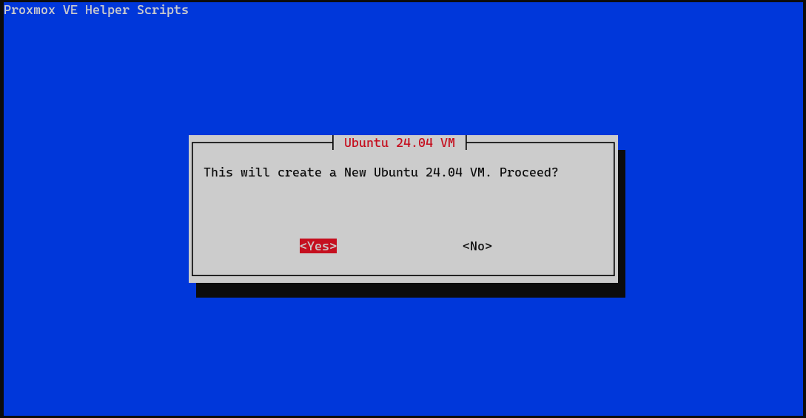

Ubuntu 24.04 VM을 새로 생성할 것인지 묻는 화면이다. `<Yes>`를 선택하자.

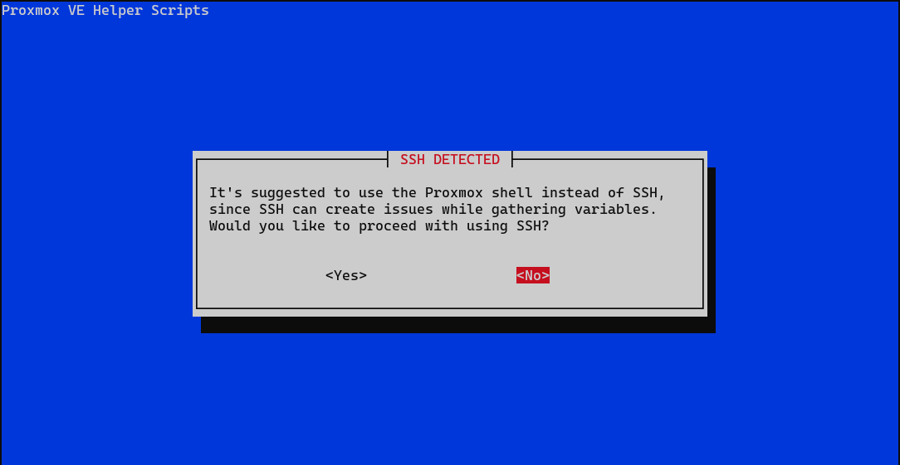

다음으로 SSH를 통해 설치를 진행할 것인지 묻는 화면이 나타난다. Proxmox 웹 인터페이스의 Shell을 사용하는 것이 좋지만, 이미 SSH로 접속한 경우 `<Yes>`를 선택하자.

### VM 옵션 설정

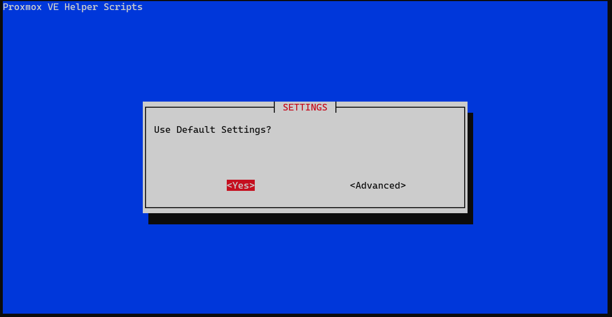

다음으로 VM의 옵션을 설정할지 묻는 화면이다. 기본 설정을 그대로 사용하고 싶다면 `<Yes>`를 선택하자.

그러나, VM ID를 특정 값으로 설정하고 싶다면 `<Advanced>`를 선택하자. 예를 들어, VM ID를 `1000`으로 설정해보자.

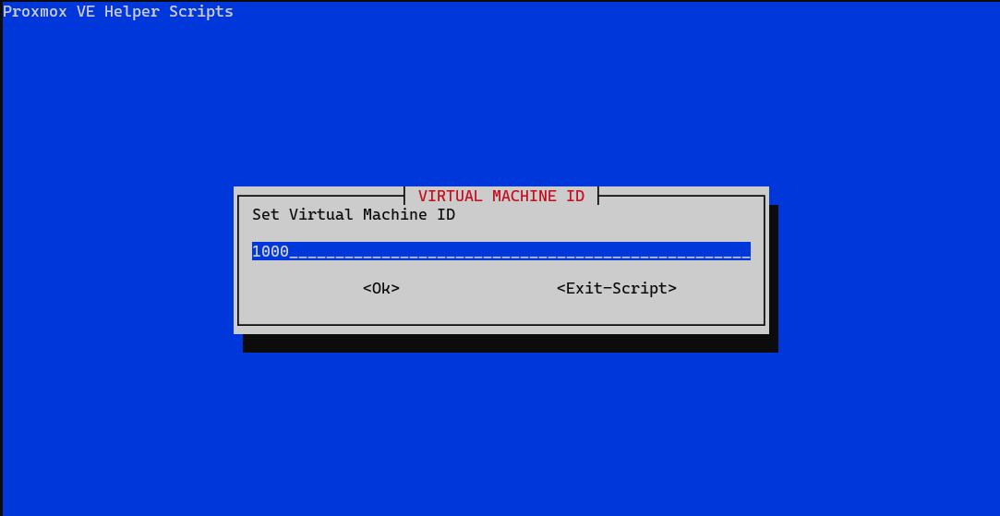

위와 같은 화면이 나타나면 원하는 VM ID 값을 입력하고 `<OK>`를 선택하자.

그 후, 추가적인 설정 화면이 나타난다. 필요한 VM 옵션을 변경한 후 `<Enter>` 키나 `<OK>`를 선택하자.

#### GGos3 기본 설정

참고로, GGos3의 기본 설정은 다음과 같다:

- VM ID: 1000
- Machine Type: q35
- Hostname: ubuntu-24.04-template
- CPU Model: Host
- Allocated Cores: 1
- RAM: 1024

### VM 생성 완료

모든 설정을 마치면 스크립트가 VM을 생성한다. 이때, `qcow2` 이미지 파일을 다운로드받는 과정을 거친다.

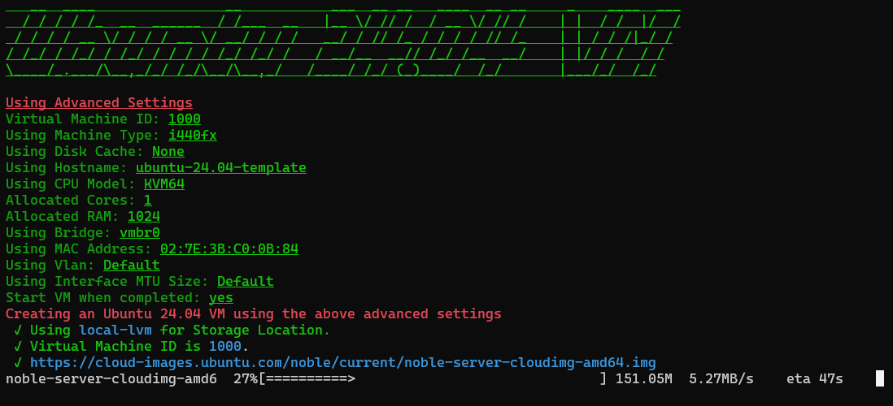

다운로드가 완료되면 아래와 같은 화면이 나타나며 VM 생성이 완료된다.

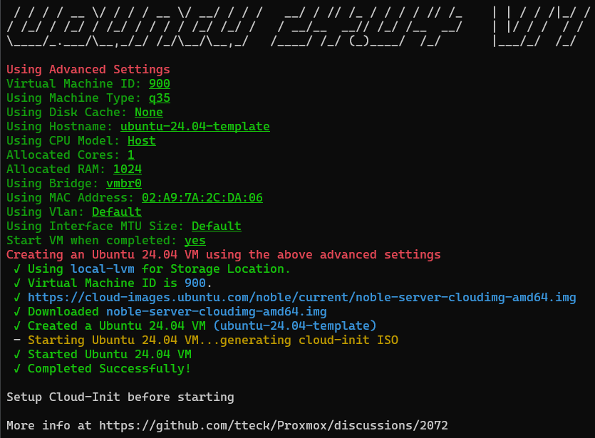

이제 Proxmox 웹 인터페이스에서 생성된 VM을 확인할 수 있다.

## Template 설정

이제 생성된 VM을 이용해 Template을 생성해보자.

VM이 실행 중이라면 먼저 STOP을 시키자.

### VM Disk 크기 변경

VM의 Hardware 탭으로 이동하자.

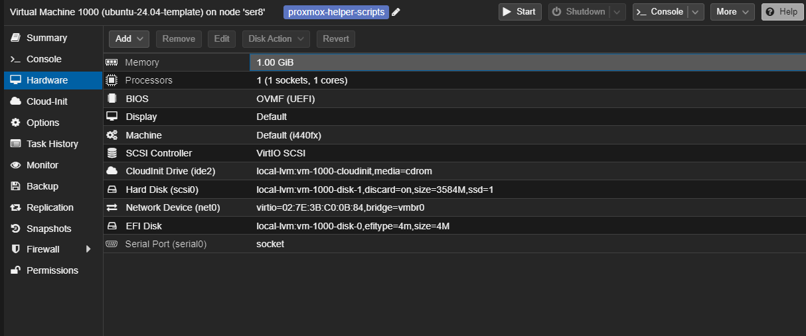

`Hard Disk (scsi0)`의 크기가 3584M으로 설정되어 있는데, 이를 변경해야 한다.

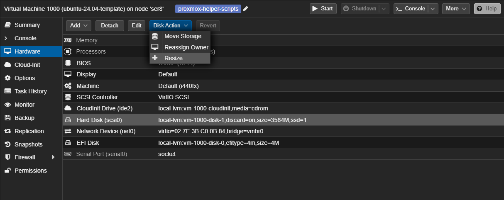

`Hard Disk (scsi0)`를 선택하고 `Disk Action`에서 `Resize disk`를 선택하자.

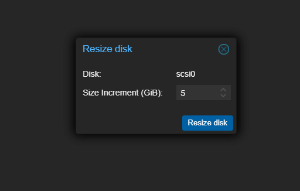

위와 같은 창이 나타나면 원하는 크기를 입력하고 `Resize disk`를 선택하자.

참고로, VM Disk Size를 줄이는 것은 매우 번거로우니 최소한의 크기로 설정해두는 것이 좋다.

위와 같이 설정하면 VM Disk Size는 8GB = 3.5(이미지 파일)GB + 5GB가 된다.

### Cloud-Init 설정

다음은 템플릿의 Cloud-Init 설정을 하자.

해당 VM의 `Cloud-Init` 탭으로 이동하자.

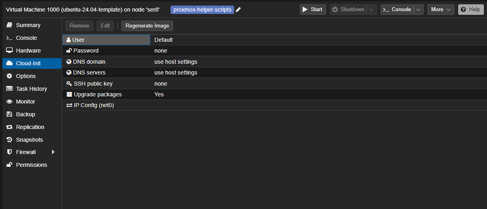

위 사진과 같이 아무런 설정도 되어있지 않을 텐데, 원하는 정보로 설정한 뒤 `Regenerate Image` 버튼을 누르자.

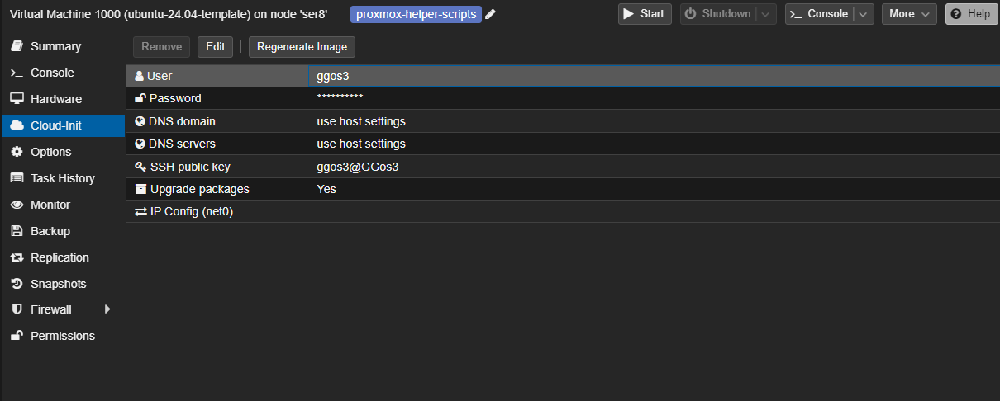

필자는 User, Password, SSH Public key를 설정했다.

### Template 생성

모든 설정이 끝나면 VM을 선택하고 `More` -> `Convert to Template`을 선택하자.


위와 같이 VM 아이콘이 변경되면 Template 생성이 완료된 것이다.

## Template 사용

이제 생성된 Template을 이용해 VM을 생성해보자.

먼저 생성된 Template을 우클릭한 뒤 `Clone`을 선택하자.

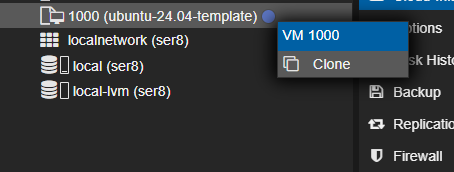

다음으로 VM의 정보를 설정하자.

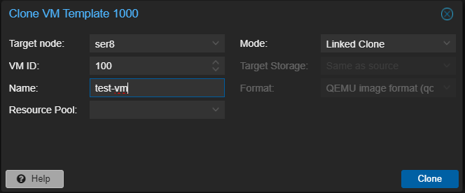

설정이 완료되면 `Clone`을 선택하자.

이제 생성된 VM의 Cloud-Init으로 이동하여 IP를 설정하자.

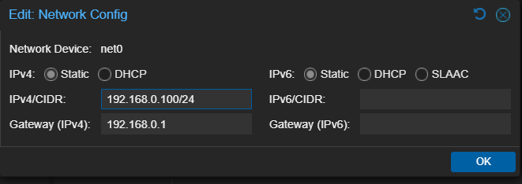

필자는 VM ID와 IP를 일치시켰다.

이제 VM을 시작하면 된다.

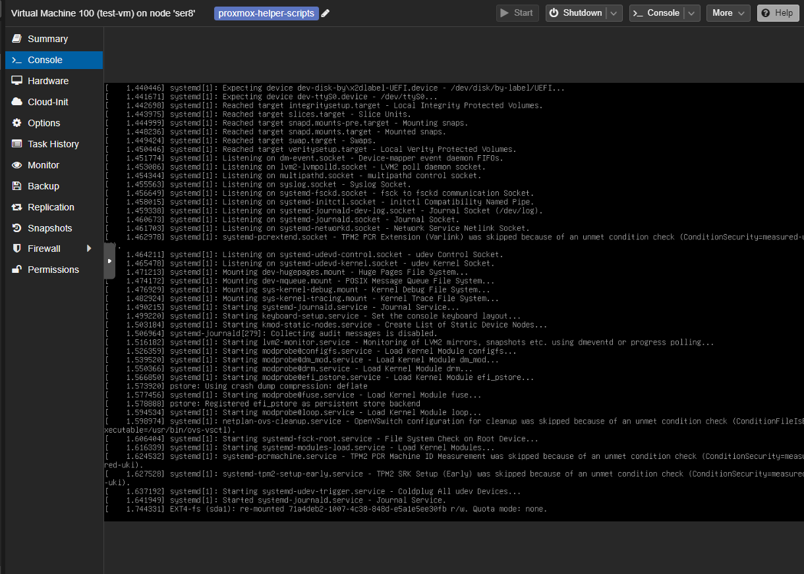

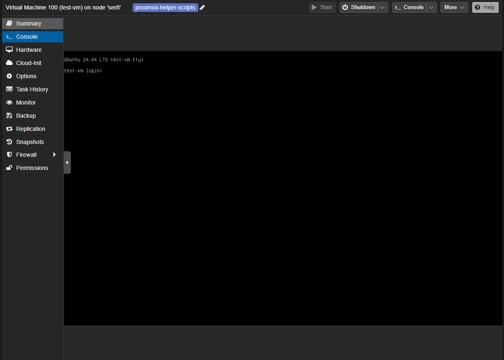
