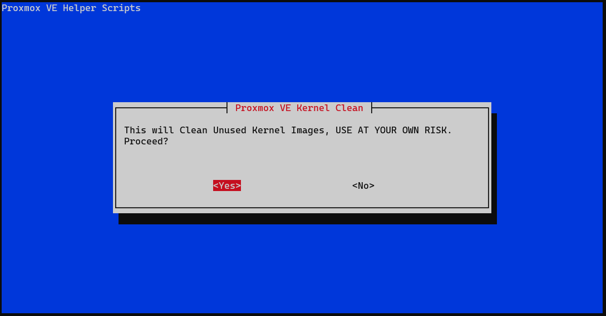
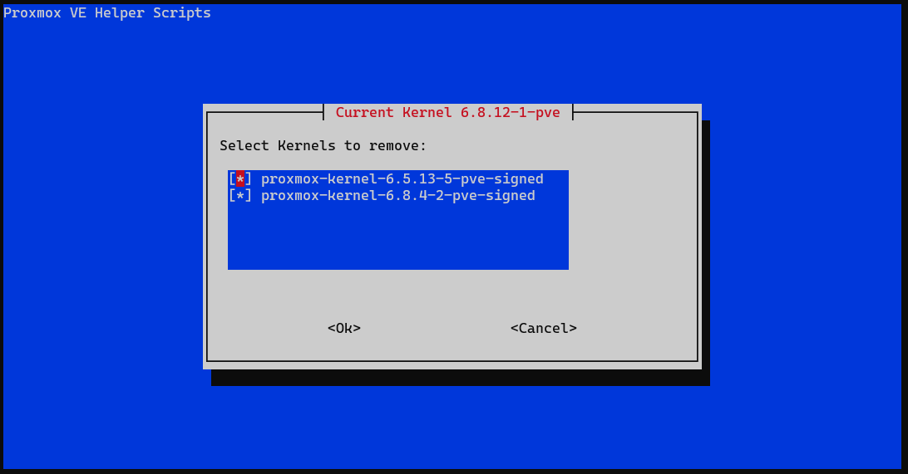
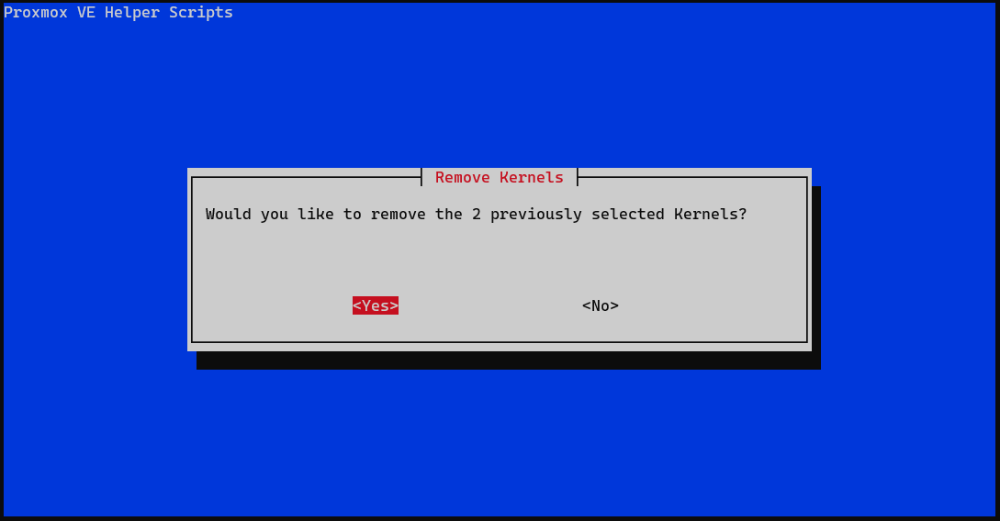

Proxmox VE를 설치한 후, 기본적인 설정을 진행해보자.

## Proxmox 설치 후

Proxmox VE를 설치하고 나면 꼭 해야 할 설정들이 있다.

### 필수 설정

- `Enterprise Repo` 비활성화
- `PVE Source` 추가
- `Test Repo` 추가
- `No-Subscription` 메시지 제거
- `Proxmox Update` 확인 및 적용

이 작업들은 몇 번은 직접 할 수 있지만, 반복되면 귀찮아진다.

다행히, 이 작업들을 간편하게 해결할 수 있는 스크립트가 있다.

## tteck/Proxmox

[tteck.github.io](https://tteck.github.io/Proxmox)에서는 Proxmox를 위한 여러 스크립트를 제공한다. 이 스크립트들은 Proxmox VE Shell에서 사용 가능하다.

그 중에서도 `Proxmox VE Post Install` 스크립트를 사용하면, 앞서 언급한 필수 설정들을 한 번에 해결할 수 있다.

### Proxmox VE Post Install 스크립트 실행

```bash
bash -c "$(wget -qLO - https://github.com/tteck/Proxmox/raw/main/misc/post-pve-install.sh)"
```

위 명령어를 실행하면 Proxmox VE Post Install 스크립트가 실행되어 필요한 설정들을 자동으로 처리해준다.

스크립트 내용에는 문제될 것이 없으니, 항목들을 보고 필요한 설정에 'y'를 입력하면 된다.


### 이전 버전 Kernal 삭제

업데이트를 진행하고 난다면 이전 버전의 Kernel이 남아 있을 수 있다.

여러 버전의 Kernel이 남아있으면 지저분하니 지워주도록 하자

```bash
bash -c "$(wget -qLO - https://github.com/tteck/Proxmox/raw/main/misc/kernel-clean.sh)"
```



스크립트를 정말로 실행할 것인지 묻는 화면이다.

거침없이 `<Yes>`를 입력하자



다음은 어떤 Kernel을 삭제할 것인지 묻는 화면이다.

현재 사용중인 커널은 표시되지 않으니 전부 지워도 무방하다.

`SPACE`를 눌러 모두 선택한 뒤 `ENTER`를 눌러 삭제하자



`<Yes>`

스크립트 실행이 끝났다면 아래 명령어를 입력해서 남은 Kernel을 확인해보자

```bash
proxmox-boot-tool kernel list
```

```bash
Manually selected kernels:
None.

Automatically selected kernels:
6.8.12-1-pve
```

이렇게 나오면 성공이다.