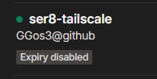
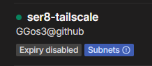
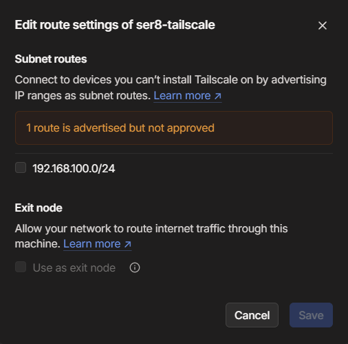

Ubuntu에서 Tailscale Subnet과 Exit Node를 설정하는 방법을 알아보자.

## Tailscale 설치

### 시스템 업데이트

```bash
sudo apt update && sudo apt upgrade -y
```

### Tailscale 설치

```bash
curl -fsSL https://tailscale.com/install.sh | sh
```

### 다운로드 확인

```bash
sudo tailscale up
```

화면에 표시된 URL을 클릭하여 인증을 완료하자.

```
To authenticate, visit:

        https://login.tailscale.com/a/8ed58fa01260b
```

로그인에 성공하면 아래와 같은 메시지가 출력된다.

```
Success.
Some peers are advertising routes but --accept-routes is false
```

## Tailscale 설정

### 이름 변경

기본 이름은 `tailscale`로 설정된다. 이를 변경하려면 [Tailscale 관리 페이지](https://login.tailscale.com/admin/machines)로 이동하자.

1. 변경하고자 하는 MACHINE을 선택한다.
2. `...`를 클릭한 후, `Edit machine name...`을 선택한다.
3. `Auto-generate from OS hostname` 체크를 해제한 후, 원하는 이름으로 수정한다.
4. `Update name` 버튼을 눌러 이름을 변경한다.

필자는 `ser8-tailscale`이라는 이름을 사용하였다.

### 키 만료 해제

키 만료를 해제하려면, 동일한 관리 페이지에서 아래 단계를 따라 진행하자.

1. 다시 `...`를 클릭한다.
2. `Disable key expiry`를 선택한다.



위 사진처럼 Node에 `Expiry disabled` 항목이 추가된 것을 확인할 수 있다.

## Subnet 설정

이제 기본 설정이 완료된 머신에 Subnet 설정을 적용해보자.

### Enable IP Forwarding

먼저 해당 머신을 통해 트래픽을 전송하려면 IP Forward 설정이 필요하다.

#### IPv4 설정

```bash
echo 'net.ipv4.ip_forward = 1' | sudo tee -a /etc/sysctl.d/99-tailscale.conf
```

#### IPv6 설정

```bash
echo 'net.ipv6.conf.all.forwarding = 1' | sudo tee -a /etc/sysctl.d/99-tailscale.conf
```

만약 방화벽을 사용 중이라면, 아래 명령어도 실행하자.

```bash
firewall-cmd --permanent --add-masquerade
```

### 설정 적용

```bash
sudo sysctl -p /etc/sysctl.d/99-tailscale.conf
```

### Subnet 설정

공유하고 싶은 대역을 설정하려면 아래 명령어를 사용한다. 예시에서는 `192.168.100.0/24` 대역을 공유한다.

```bash
sudo tailscale up --advertise-routes=192.168.100.0/24
```

> 여러 대역을 공유할 경우 아래와 같이 설정할 수 있다.
> ```bash
> sudo tailscale up --advertise-routes=192.168.100.0/24,198.51.100.0/24
> ```

명령어 실행 시 아래와 같은 메시지가 표시된다.

```bash
Warning: UDP GRO forwarding is suboptimally configured on eth0, UDP forwarding throughput capability will increase with a configuration change.
See https://tailscale.com/s/ethtool-config-udp-gro
Some peers are advertising routes but --accept-routes is false
```

### Admin Console 확인

Tailscale Admin Console로 돌아가서, 설정한 머신에 `Subnets`라는 항목이 생긴 것을 확인할 수 있다.



하지만 아직 Subnet이 활성화되지 않았다.

### Route Settings 변경

Subnet 설정을 완료하려면 아래 단계를 따라 진행하자.

1. 설정할 머신을 선택한다.
2. `...`를 클릭한 후, `Edit route settings...`를 선택한다.
3. `192.168.100.0/24` 대역을 체크하고, `Save` 버튼을 눌러 설정을 완료한다.


이후 아래 사진과 같이 `Subnets` 항목의 경고가 사라진다.



## Exit Node 설정

이제 Exit Node를 설정해보자.

### 설정 적용

```bash
sudo tailscale up --advertise-exit-node
```

### Admin Console 확인

Exit Node 설정이 제대로 적용되었는지 확인하려면 Admin Console로 이동하자. 앞서 Subnet 설정 시와 동일한 절차로 설정이 적용되었는지 확인한다. Exit Node가 제대로 설정되었으면, Admin Console에서 이를 확인할 수 있다.

---

위와 같이 설정하면 Ubuntu에서 Tailscale Subnet과 Exit Node 설정이 완료된다. 이제 안전하게 네트워크를 공유하고, 원하는 머신을 Exit Node로 사용할 수 있다.
